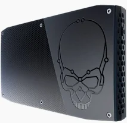
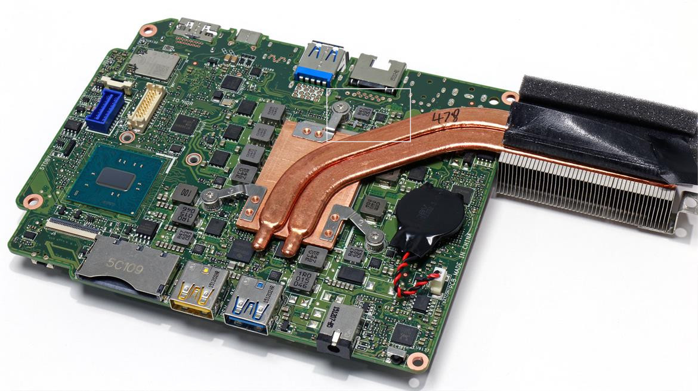
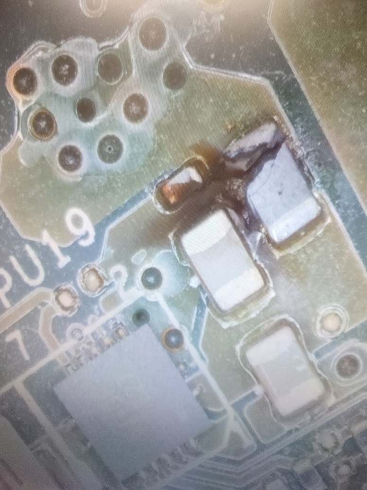
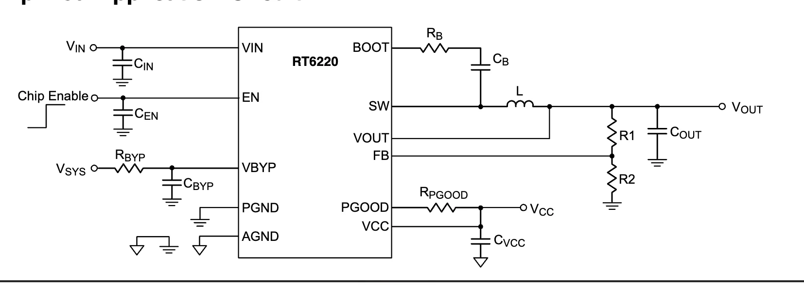

A blown inductor part of a buck converter on the mainboard prevents any display.

{ style="display: block; margin: 0 auto" }

My desktop computer, an Intel NUC Skull Canyon (6i7KYKY) [^8] suddenly stopped
working with a blank display. Being SSD-based and passively cooled I could only
notice that the laptop seems to startup, and blinking some LEDs on the
motherboard.

Switching screen to other outputs did not improve the situation, confirming that
all outputs were affected. Removing RAM would change nothing but trigger the 3
bip error code when none was present, and same for the SSD. At least that would
confirm the processor was still alive and the problem might be limited to the
display.

Board inspection allowed to quickly find the source of the failure, a blown component, and an IC with several short circuits, labelled "6J=3F E27". Searching on the internet for the failure and model name quickly lead to a series of videos [^1] showing similar repair attempts.

{ style="display: block; margin: 0 auto" }

{ style="display: block; margin: 0 auto" }

## Searching for the component

Finding the marking on Google did not return any result but an eBay search found references to a RT6220AGQUF voltage regulator [^2]. The datasheet gives us a matching package and pinout, which seems to confirm we found the correct chip. Furthher more we are not surprised that a component exposed to input voltage might fail.

{ style="display: block; margin: 0 auto" }

Coupling this reference with our NUC6i7KYK model now allows us to find many more instances of this failure, confirming it is actually a recurrent issue on those boards. [^3] [^4] [^5] [^6] [^7]

The PIN position in the datasheet is off by 90 degrees, but allows us to confirm the inductor is upstream to the VIN pin of the chip, and the measurement on the top pin indeed shows a voltage of 19V, which is interrupted by the blown component. In addition, testing for the capacitors around reveal some shorted components which we might assume are caused by the IC.

According to the datasheet:

> Power input connect to high-side MOSFET drain. Place 2pcs 10uF MLCC decoupling capacitors near input pin

It is likely the MOSFETs are responsible for the short and the IC caused the failure.  While we cannot be fully sure this is the only cause, and that no other components are damaged (eg. the CPU or GPU), we will try ordering and replacing both. We have at least a case of a successful repair in [^6], and comments in the video are suggesting some components values. Capacitors should be 10uF, 25V capacitors which matches the datasheet recommendation, and the additional (blown) component must be an inductor. There it is suggsted that any value will fit, and that we could even replace it by a 0 ohm resistor. We will avoid this last solution as such inductors are useful to filter current fluctuations and noise, and might help with impedance matching to better transfer power. 

Lacking any reference value, we will use a 1uH as in the rest of the reference application circuit with 1V output. As for the package, measurement using a ruler seems to indicate that both inductors and capacitors are in 0805 package, which allows us to finalize our order for both components at a cost of a few euros online.

## Repair

Over the different documented repair attempts, it seems that at least one has been successful. We will be optimistic and assume that the fault is entirely related to the IC, and led to the inductor burning.

Order both on Aliexpress, much chepaer than ebay (a rati of 1-to-15):

- RT6220AG : 5.80€ (5pcs)
- 0805 induction 1uH : 1€37 (50 pcs)

The plan is to desolder the inductor and the IC and confirm the shorts are gone, then proceed to the replacement, and pray for the best.

## Attempt 1

Short seems solved
After 40s new short
Same component blows again

This time short persists after removing the two components like first time.

Following the power rails on the other side of the board, i can trace to a short
MOSFET : VCM 69

search for marking: WCM, package: SOT23
power MOSFET

once removed, still a short, 1 ohm, drawing 1 amp at reast when injecting
voltage

nothing heats up

## Other eferences

Intel Alder Lake N Platform
https://www.pollin.de/media/84/b0/fb/1716877353/D811684-D.pdf

To be continued...

## Remaining questions

What is the interest of resistance measurements to ground at various points, that people are doing ?

## References

[^1]: SureCanDo youtube channel: [1](https://www.youtube.com/watch?v=zz_LzeaPfl4), [2](https://www.youtube.com/watch?v=pquomCqkDZk), [3 Part1](https://www.youtube.com/watch?v=sUO-TVGFZKs), [3 Part 2 (a)](https://www.youtube.com/watch?v=iKqK2N7s4bg)[ (b)](https://www.youtube.com/watch?v=NrBiMYH0KX4), [3 Part 3 (a)](https://www.youtube.com/watch?v=K90za7R4Qjs) [(b)](https://www.youtube.com/watch?v=Co1jgte02C0)

[^2]: [Richtek RT6220AGQUF](https://www.mouser.fr/ProductDetail/Richtek/RT6220AGQUF) - [Datasheet](https://www.richtek.com/assets/product_file/RT6220/DS6220-11.pdf)

[^3]: [Question about the value of a component in nuc6i7kyk](https://www.forosdeelectronica.com/threads/duda-sobre-valor-de-un-componente-en-nuc6i7kyk.174590/)

[^4]: [Intel NUC6i7KYK.Help identify burnt capacitor?](https://www.badcaps.net/forum/troubleshooting-hardware-devices-and-electronics-theory/troubleshooting-desktop-motherboards-graphics-cards-and-pc-peripherals/76101-intel-nuc6i7kyk-help-identify-burnt-capacitor)

[^5]: [Intel NUC6i7KYK won't boot](https://vlab.su/viewtopic.php?f=222&t=140053)

[^6]: [Intel NUC Kit Mainboard Repair](https://www.youtube.com/watch?v=ZBfpRzx3JIY)

[^7]: https://www.reddit.com/r/ElectronicsRepair/comments/1c5cuyi/is_this_buck_converter_faulty/

[^8]: https://www.tweaktown.com/reviews/7728/intel-skull-canyon-nuc-nuc6i7kyk-mini-pc-review/index.html
